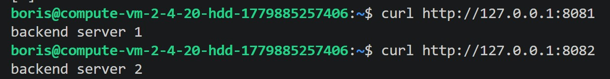
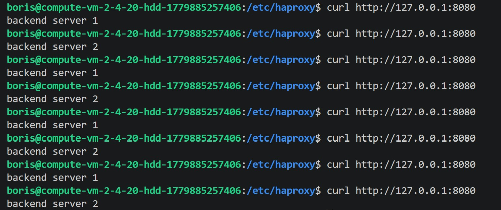
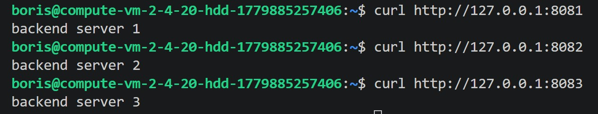
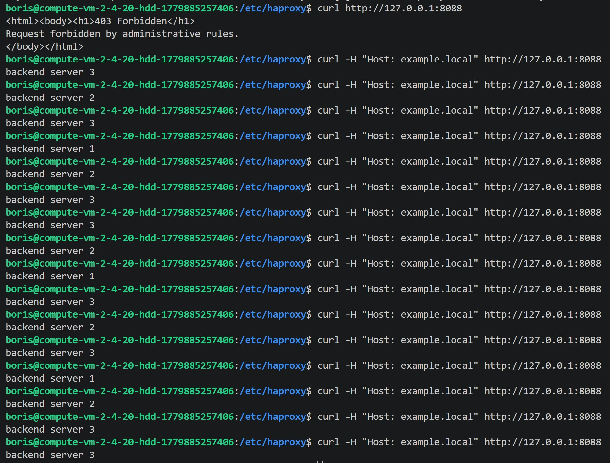

# Домашнее задание к занятию "Кластеризация и балансировка нагрузки" - Горелик Борис


### Задание 1

Запустите два simple python сервера на своей виртуальной машине на разных портах
Установите и настройте HAProxy, воспользуйтесь материалами к лекции по ссылке
Настройте балансировку Round-robin на 4 уровне.
На проверку направьте конфигурационный файл haproxy, скриншоты, где видно перенаправление запросов на разные серверы при обращении к HAProxy.

#### haproxy.cfg
```
global
    log /dev/log local0
    log /dev/log local1 notice
    chroot /var/lib/haproxy
    stats socket /run/haproxy/admin.sock mode 660 level admin expose-fd listeners
    stats timeout 30s
    user haproxy
    group haproxy
    daemon

    ca-base /etc/ssl/certs
    crt-base /etc/ssl/private

    ssl-default-bind-ciphers ECDHE-ECDSA-AES128-GCM-SHA256:ECDHE-RSA-AES128-GCM-SHA256:ECDHE-ECDSA-AES256-GCM-SHA384:ECDHE-RSA-AES256-GCM-SHA384:ECDHE-ECDSA-CHACHA20-POLY1305:ECDHE-RSA-CHACHA20-POLY1305:DHE-RSA-AES128-GCM-SHA256:DHE-RSA-AES256-GCM-SHA384
    ssl-default-bind-ciphersuites TLS_AES_128_GCM_SHA256:TLS_AES_256_GCM_SHA384:TLS_CHACHA20_POLY1305_SHA256
    ssl-default-bind-options ssl-min-ver TLSv1.2 no-tls-tickets

defaults
    log global
    mode tcp
    option tcplog
    option dontlognull
    timeout connect 5000
    timeout client 50000
    timeout server 50000

listen stats
    bind :888
    mode http
    stats enable
    stats uri /stats
    stats refresh 5s
    stats realm Haproxy\ Statistics

listen web_tcp
    bind :8080
    mode tcp
    balance roundrobin
    option tcp-check
    server s1 127.0.0.1:8081 check inter 3s
    server s2 127.0.0.1:8082 check inter 3s
```






---

### Задание 2

Запустите три simple python сервера на своей виртуальной машине на разных портах
Настройте балансировку Weighted Round Robin на 7 уровне, чтобы первый сервер имел вес 2, второй - 3, а третий - 4
HAproxy должен балансировать только тот http-трафик, который адресован домену example.local
На проверку направьте конфигурационный файл haproxy, скриншоты, где видно перенаправление запросов на разные серверы при обращении к HAProxy c использованием домена example.local и без него.


#### haproxy.cfg
```
global
    log /dev/log local0
    log /dev/log local1 notice
    chroot /var/lib/haproxy
    stats socket /run/haproxy/admin.sock mode 660 level admin expose-fd listeners
    stats timeout 30s
    user haproxy
    group haproxy
    daemon

defaults
    log global
    mode http
    option httplog
    option dontlognull
    timeout connect 5000
    timeout client 50000
    timeout server 50000

listen stats
    bind :888
    mode http
    stats enable
    stats uri /stats
    stats refresh 5s
    stats realm Haproxy\ Statistics

frontend example_front
    bind :8088
    mode http

    acl host_example hdr(host) -i example.local
    http-request deny unless host_example
    use_backend example_back if host_example

backend example_back
    mode http
    balance roundrobin
    option httpchk GET /index.html

    server s1 127.0.0.1:8081 weight 2 check
    server s2 127.0.0.1:8082 weight 3 check
    server s3 127.0.0.1:8083 weight 4 check
```



